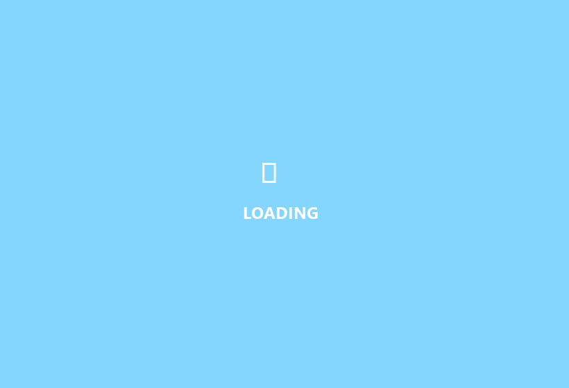

# 🌐 Legacy Portfolio Web App (CRA Edition - Iteration 1)

> Primera versión del portafolio personal interactivo, construida con React (Create React App), SCSS y consumo directo de la API pública de GitHub para renderizar dinámicamente los repositorios del usuario.

---

## 🎬 Demostración Visual (Demo)



---

## 🏛️ Arquitectura y Características Técnicas

* **Framework Base:** React (Create React App) con JavaScript moderno.
* **Integración API en Tiempo Real:** Consumo de la GitHub REST API (`https://api.github.com/users/yefcode/repos`) mediante `fetch`, filtrando repositorios propios y excluyendo forks.
* **Interacciones y Estilos:**
  * **Sección About:** Presentación personal y stack técnico formativo.
  * **Barra de Navegación Suave:** Navbar flotante con transición y cambio de estilo dinámico al hacer scroll (`offset > 50px`).
  * **Módulo de Contacto:** Formulario controlado que genera y enlaza automáticamente correos con `mailto:` URI codificado.
  * **Estilizado Modular:** SCSS modularizado con variables de color y mixins de diseño.

---

## 🚀 Puesta en Marcha Local

### Prerrequisitos
* Node.js v14 - v18.

### Instalación y Ejecución
```bash
# 1. Instalar dependencias
npm install

# 2. Iniciar servidor de desarrollo
npm start
```
Abre [http://localhost:3000](http://localhost:3000) en el navegador.

---

## 🧪 Scripts Disponibles

```bash
# Compilar bundle de producción
npm run build

# Ejecutar tests
npm test
```
