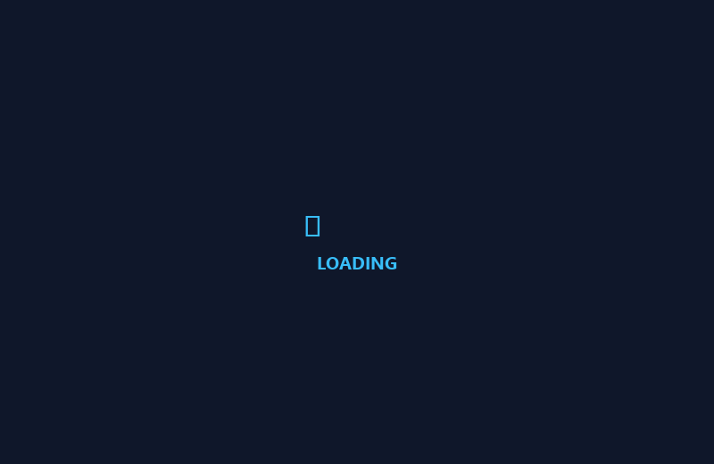

# 🌐 Legacy Portfolio Web App (CRA Edition - Iteration 2)

> Segunda iteración del portafolio personal interactivo, desarrollada en React (Create React App), SCSS con tema oscuro/dark-mode, pantalla de carga animada (loader) y efecto de máquina de escribir (typewriter).

---

## 🎬 Demostración Visual (Demo)



---

## 🏛️ Arquitectura y Características Técnicas

* **Framework Base:** React (Create React App) con JavaScript moderno y animaciones CSS avanzadas.
* **Pantalla de Carga (LoadScreen):** Componente de precarga animado con reloj de arena (`lds-hourglass`) para mejorar el flujo perceptual del visitante.
* **Efecto Typewriter:** Animación tipográfica en CSS para la presentación dinámica de tecnologías en la cabecera.
* **Consumo API GitHub:** Carga en tiempo real de proyectos públicos desde `https://api.github.com/users/yefcode/repos`, integrando botones oficiales de GitHub (`Star`, `Watch`, `Fork`).
* **Formulario de Contacto Directo:** Validación en cliente y emisión de enlaces preformateados `mailto:`.

---

## 🚀 Puesta en Marcha Local

### Prerrequisitos
* Node.js v14 - v18.

### Instalación y Ejecución
```bash
# 1. Instalar dependencias
npm install

# 2. Iniciar servidor de desarrollo
npm start
```
Abre [http://localhost:3000](http://localhost:3000) en el navegador.

---

## 🧪 Scripts Disponibles

```bash
# Compilar bundle de producción
npm run build

# Ejecutar tests
npm test
```
