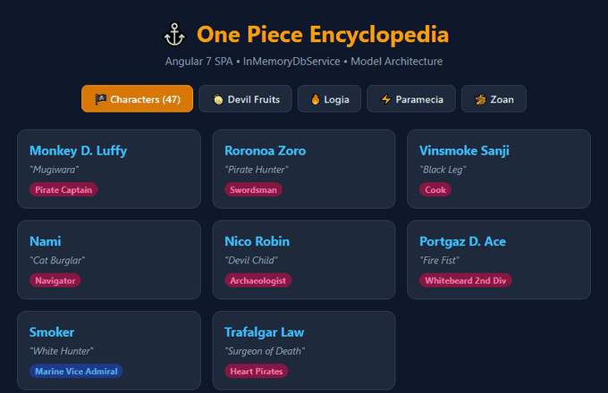

# 🏴‍☠️ One Piece Encyclopedia (Angular SPA)

> SPA didáctica e interactiva construida con Angular 7, Angular Material, RxJS e InMemoryDbService para catalogar y explorar personajes y frutas del diablo del universo One Piece.

---

## 🎬 Demostración Visual (Demo)



---

## 🏛️ Arquitectura y Características Técnicas

* **Framework Base:** Angular 7.1.2 con TypeScript y Angular CLI.
* **Enrutamiento Declarativo:** Navegación modular por tabs mediante `RouterModule`:
  * `/character/one-piece-character`: Directorio maestro de personajes con apodos y nombres de tripulación.
  * `/devil-fruit`: Listado completo de frutas con subtipos clasificados.
  * `/devil-fruit-logia`: Sub-vista específica para frutas de tipo Logia.
  * `/devil-fruit-paramecia`: Sub-vista para frutas de tipo Paramecia.
  * `/devil-fruit-zoan`: Sub-vista para frutas de tipo Zoan y modelos ancestrales.
* **Capa de Datos Simulada (Mock Service):** Integración con `angular-in-memory-web-api` (`InMemoryDataService`) proveyendo endpoints simulados (`api/characters` y `api/devilFruit`) sin requerir backend activo.
* **Diseño y Componentes:** Angular Material (`CustomMaterialModule`) y maquetación responsiva con SCSS.

---

## 🚀 Puesta en Marcha Local

### Prerrequisitos
* Node.js v10 - v14 (recomendado con `nvm` o soporte legacy).
* Angular CLI v7 (`npm install -g @angular/cli@7.1.2`).

### Instalación y Ejecución
```bash
# 1. Instalar dependencias
npm install

# 2. Iniciar servidor de desarrollo
npm start
# o alternativamente:
ng serve
```
Navega a [http://localhost:4200/](http://localhost:4200/). La aplicación se recargará automáticamente ante cualquier modificación en `src/`.

---

## 🧪 Pruebas Automatizadas

```bash
# Ejecutar pruebas unitarias con Karma
npm test

# Ejecutar pruebas end-to-end con Protractor
npm run e2e
```