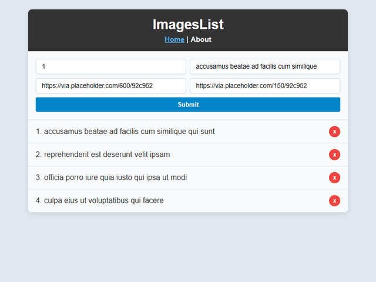

# 📝 React Task Tracker & Image Manager

> Aplicación SPA interactiva desarrollada en React 16.8+ (Create React App), React Router v5 y Axios para la gestión dinámica de tareas e imágenes sincronizadas con la API REST pública de JSONPlaceholder.

---

## 🎬 Demostración Visual (Demo)



---

## 🏛️ Arquitectura y Características Técnicas

* **Framework Base:** React 16.8+ con JavaScript (ES6+).
* **Consumo de API REST Externa:** Integración con JSONPlaceholder (`https://jsonplaceholder.typicode.com/photos`) mediante Axios:
  * `GET /photos?_limit=10`: Carga inicial de elementos en el ciclo de vida del componente (`componentDidMount`).
  * `POST /photos`: Creación reactiva de nuevas tarjetas de imagen/tarea.
  * `DELETE /photos/:id`: Eliminación con actualización optimista del estado local.
* **Enrutamiento Declarativo:** Gestión de vistas con `react-router-dom`:
  * `/`: Vista principal con formulario interactivo `AddImage` y lista de elementos `Images`.
  * `/about`: Vista estática informativa sobre el propósito de la aplicación y versión.
* **Manejo de Formularios y Estado:** Componentes controlados con validación de tipos mediante `prop-types`.

---

## 🚀 Puesta en Marcha Local

### Prerrequisitos
* Node.js v14 - v18 (recomendado).

### Instalación y Ejecución
```bash
# 1. Instalar dependencias
npm install
# o con yarn:
yarn install

# 2. Iniciar servidor de desarrollo
npm start
```
Abre [http://localhost:3000](http://localhost:3000) en el navegador.

---

## 🧪 Scripts Disponibles

```bash
# Ejecutar pruebas unitarias
npm test

# Compilar para producción
npm run build
```
